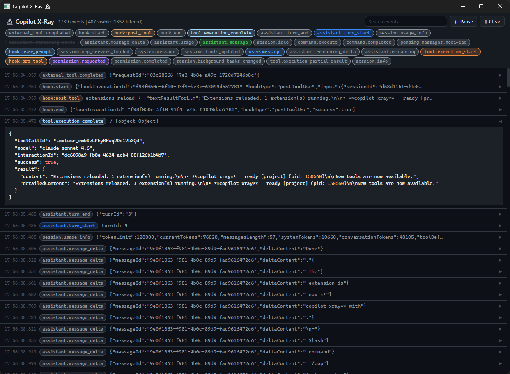

# Copilot X-Ray 🔬

A GitHub Copilot CLI extension that opens a native desktop window showing **every event happening inside your session in real time** — messages, tool calls, MCP calls, skill/plugin loads, hooks, permissions, errors, and more.



> **Want to see when skills, agents, plug-ins, and MCP servers get loaded into the context?**  
> X-Ray shows you the raw wire — no filtering, no summaries, just the truth.

---

## Features

- **Live event feed** — auto-opens when your session starts, streams every event as it happens
- **All event types** covered: `user.message`, `assistant.message`, `tool.execution_start/complete`, `hook:pre_tool`, `hook:post_tool`, `hook:session_start/end`, `permission.requested`, `session.error`, `session.shutdown`, and every other event the SDK emits
- **Filter pills** — auto-generated per event type; click to show/hide categories
- **Full-text search** — searches across type name and raw JSON payload
- **Expandable raw JSON** — click any row to see the complete event data with syntax highlighting
- **Pause / Resume** — freeze auto-scroll to inspect events; resume to catch up
- **Clear** — wipe the feed and start fresh
- **Zoom** — use `Ctrl`+`scroll` or `Ctrl`+`+`/`-` to zoom the window in or out
- `assistant.streaming_delta` hidden by default (very noisy) — toggle it back on via its filter pill

---

## Requirements

- GitHub Copilot CLI installed and authenticated
- **Experimental features enabled** — X-Ray relies on APIs that are currently behind the experimental flag. Run `copilot config` and enable experimental features before installing.
- Windows (uses WebView2 / Edge), macOS (WKWebView), or Linux (webkit2gtk)
- Node.js 20+

---

## Installation

### Option A — Add to a specific project (recommended)

Clone the repo into a temporary location, copy just the extension folder into your project, then clean up:

```bash
# from your project root (macOS / Linux / Windows Git Bash / WSL)
git clone --depth 1 https://github.com/EngstromJimmy/copilot-xray /tmp/xray
mkdir -p .github/extensions
cp -r /tmp/xray/.github/extensions/copilot-xray .github/extensions/
rm -rf /tmp/xray
cd .github/extensions/copilot-xray && npm install
```

Copilot CLI discovers and loads it automatically the next time you open a session in that repo.

### Option B — Clone manually

```bash
git clone https://github.com/EngstromJimmy/copilot-xray
cd copilot-xray && npm install
```

Then move the cloned folder to `.github/extensions/copilot-xray/` inside any project you want to use X-Ray in (you can add it to `.gitignore` to avoid committing it).

---

## Usage

X-Ray runs quietly in the background from the moment your session starts, buffering up to **1 000 events** in a ring buffer. Open the window whenever you want to inspect traffic:

```
/copilot-xray
```

When you open it you'll see everything that happened since the session started (up to the buffer limit). The agent can also open, interact with, and close the window through built-in tools — no extra configuration needed.

### Configuring the buffer size

Set the `XRAY_MAX_EVENTS` environment variable before starting Copilot CLI:

```bash
# Keep the last 500 events (default is 1000)
XRAY_MAX_EVENTS=500 copilot

# Unlimited buffering (be mindful of memory in long sessions)
XRAY_MAX_EVENTS=0 copilot
```

---

## How it works

X-Ray is a Copilot CLI extension built on top of [`copilot-webview`](https://github.com/SteveSandersonMS/copilot-webview-creator). It:

1. Hooks into `onSessionStart`, `onUserPromptSubmitted`, `onPreToolUse`, `onPostToolUse`, and `onSessionEnd`
2. Subscribes to **all** raw session events via `session.on((event) => ...)`
3. Buffers up to `XRAY_MAX_EVENTS` events (default 1 000) in a ring buffer — oldest are dropped when the cap is reached
4. Pushes batches into the webview page via `webview.eval('window.addEvents(...)')`
5. The vanilla JS page renders each event as an expandable row with syntax-highlighted JSON

```
Copilot CLI
    │
    ├─ hooks (onPreToolUse, onPostToolUse, …)   ───┐
    └─ session.on(ALL events)                   ───┤
                                                   ↓
                                           extension process
                                           (buffers + flushes)
                                                   │ WebSocket
                                                   ↓
                                           X-Ray webview window
                                           (live event feed)
```

---

## Development

```bash
git clone https://github.com/EngstromJimmy/copilot-xray
cd copilot-xray
npm install
```

Drop the folder into `.github/extensions/copilot-xray/` of any git repo, then open Copilot CLI there. Use `/copilot-xray` to open the window.

After editing files, run `/reload-extensions` (or type `extensions_reload` in your agent session) to pick up changes without restarting Copilot CLI.

**Editing the UI** (`content/`): vanilla HTML/JS/CSS — no build step. Just reload the window with `copilot_xray_show` with `reload: true`.

**Editing the extension logic** (`main.mjs`): reload extensions after saving.

---

## License

MIT